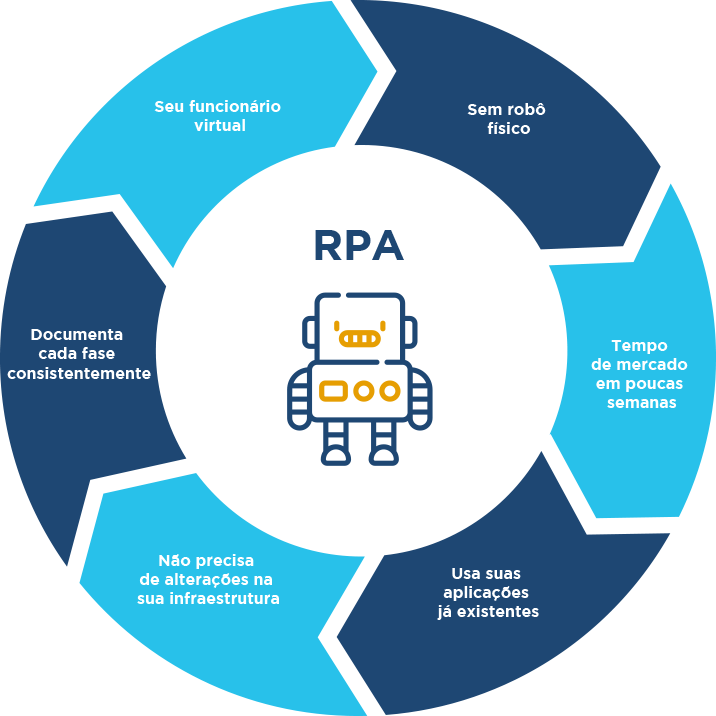

# RPArobot

RPA criado para automatizar tarefas no site do [Clash Royale](https://developer.clashroyale.com/#/)

***
Depende de:
* [Python 3.7](https://www.python.org/downloads/) (3+).
* [Node](https://nodejs.org/en/download/)

# Instruções de instalação
*Obs*: Por estar usando a lib `robotframework-browser` que usa o [Node](https://nodejs.org/en/download/) apenas Python 3.7 ou mais recente é compatível.

* Instalar o python [link](https://www.python.org/downloads/)

* Clonar o projeto, ir até o diretório que deseja executar
```
git clone https://github.com/fabricioadenir/RPArobot.git
```

* Acessar o diretório do projeto
```
cd RPArobot
```

* Instalar o [Node.js](https://nodejs.org/en/download/) seguir o roteiro padrão.
*Obs* (apenas <v15 compatível; se não tiver certeza, use 14.15.0 LTS)

* Instalar as dependências
```
pip install -r requirements.txt
```

* Instalar as dependências do node.js.
```
rfbrowser init
```
**Obs:** Se ``rfbrowser`` não for encontrado, tente ``python -m Browser.entry init``

# Instruções de Uso
* Para rodar o RPA basta executar o comando abaixo.
```
robot tasks\ClashRoyale.robot 
```
